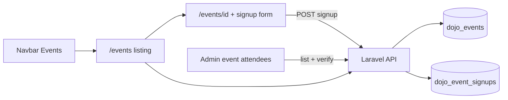

# Events listing, detail pages, and signups

## Decisions locked
- **Event fields:** add `description` (nullable text) and `ticket_url` (nullable URL); flyer remains the hero image.
- **Routing:** `/events` listing + `/events/[id]` detail; detail pages **client-fetch** Laravel (Nginx fallback for deep links to new IDs).
- **Signups:** public form on each **event detail page** (first name, last name, phone, email, number of attendees). Admin sees attendees under each event and can mark them **verified**.

## Current state
- Homepage section [EventsCalendarSection.tsx](src/components/EventsCalendarSection.tsx) + nav hash `#events-calendar`.
- Laravel `dojo_events`: `name`, `event_date`, `event_time`, `event_place`, `flyer_path` only.
- Public API today: `GET /api/events/upcoming` only.
- Public site is `output: "export"`; Forge Nginx uses `try_files` ([FORGE.md](FORGE.md)).
- No event RSVP/signup tables exist today.

## 1. Laravel — events + signups (`chicagominamidojo.com`)

### Event fields
**Migration** on `dojo_events`: `description` (text, nullable), `ticket_url` (string, nullable).

**Model / `toApiArray()`:** include the new fields.

**Admin CRUD** (`DojoEventsPage.tsx` + `routes/api.php`): textarea + optional ticket URL; validate accordingly.

**Public:** `GET /api/events/{event}`; raise upcoming list cap (e.g. 50) for the listing page.

### Signups
**New table `dojo_event_signups`:**
- `dojo_event_id` (FK cascade)
- `first_name`, `last_name` (string)
- `phone` (string)
- `email` (string)
- `attendees_count` (unsigned int, min 1)
- `verified_at` (nullable timestamp) — null = not verified; set/cleared by admin
- timestamps

**Model** `DojoEventSignup` with `belongsTo` event; `DojoEvent` `hasMany` signups.

**Public endpoint (no auth):**
- `POST /api/events/{event}/signups`
- Validate: required first/last/phone/email, email format, `attendees_count` integer min 1 max 20
- Return 201 + minimal confirmation payload (no admin-only fields needed)
- No login required; rate-limit lightly if the app already uses throttle middleware on public POSTs

**Admin endpoints (Sanctum + events permission):**
- `GET /api/admin/events/{event}/signups` — list signups for that event (newest first), include `verified_at`
- `POST /api/admin/events/signups/{signup}/verify` — body `{ verified: true|false }` sets or clears `verified_at`

**Admin UI** on `DojoEventsPage`:
- Per-event action (e.g. “Attendees” button) opens a dialog/panel for that event
- Table: name, phone, email, attendees count, signed-up date, **Verified** checkbox/toggle
- Show total signups and sum of `attendees_count` in the header

**Tests:** event field create/update + public show; public signup validation; admin list + verify toggle.

## 2. Public site (`chicagominami-public`)

**Nav** — [Navbar.tsx](src/components/Navbar.tsx):
- “Events and Calendar” → `/events`
- Other section links → `/#home`, `/#classes`, etc.

**Homepage** — remove `EventsCalendarSection`.

**Listing** — `src/app/events/page.tsx`: calendar + upcoming list; each event links to `/events/{id}`.

**Detail** — `src/app/events/[id]/page.tsx` (client):
- Eventbrite-inspired layout: flyer hero, title, date/time/place, description, optional external ticket CTA
- **Signup form** below the details: First name, Last name, Telephone, Email, Number of attendees, Submit
- On success: clear form + confirmation message; on error: inline message
- Match dojo visual language (serif titles, gold/primary CTAs)

**Static export deep links:** `generateStaticParams` + shell id `0` + Nginx fallback documented in [FORGE.md](FORGE.md).

**Shared helpers:** `src/lib/events.ts` for event type, date formatting, and signup POST helper.

## 3. Out of scope
- Slugs, rich-text editor, end times, paid ticketing/checkout, email confirmation automations, homepage event teaser.
- Changing away from static export.
- Duplicate-email blocking (allow multiple signups unless we hear otherwise).
